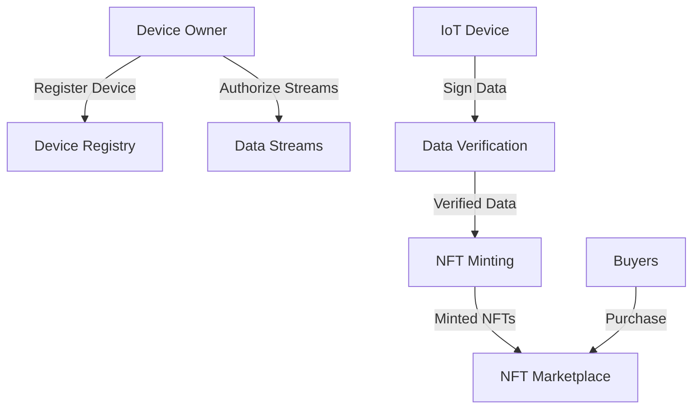

# NodeMint IoT NFT Platform

A blockchain platform that bridges physical Internet of Things (IoT) data with verifiable NFT assets, enabling the creation and trading of data-backed digital tokens.

## Overview

NodeMint creates a trustless bridge between IoT devices and blockchain assets by allowing device owners to mint NFTs backed by verified IoT data. The platform ensures data authenticity through cryptographic signatures and provides a marketplace for trading these unique digital assets.

### Key Features
- IoT device registration and management
- Cryptographically verified data streams
- SIP-009 compliant NFT minting
- Built-in NFT marketplace
- Comprehensive device ownership controls

## Architecture

The platform is built around a core smart contract that handles device registration, data verification, NFT minting, and trading functionality.



### Core Components
1. Device Registry - Manages device ownership and status
2. Data Streams - Handles data stream authorization
3. NFT System - Implements SIP-009 standard with IoT extensions
4. Marketplace - Enables NFT trading functionality

## Contract Documentation

### nodemint.clar

The main contract implementing all platform functionality including device management, NFT operations, and marketplace features.

#### Key Functions

**Device Management**
- `register-device`: Register a new IoT device
- `authorize-data-stream`: Authorize a data stream for NFT minting
- `transfer-device-ownership`: Transfer device ownership to new principal

**NFT Operations**
- `mint-iot-nft`: Create new NFT from verified IoT data
- `transfer`: Transfer NFT ownership (SIP-009)
- `get-token-uri`: Get NFT metadata URI

**Marketplace**
- `list-nft`: List NFT for sale
- `buy-nft`: Purchase listed NFT
- `cancel-listing`: Remove NFT listing

## Getting Started

### Prerequisites
- Clarinet
- Stacks wallet
- IoT device with signing capabilities

### Basic Usage

1. Register an IoT device:
```clarity
(contract-call? .nodemint register-device 
    <device-id> 
    <public-key>)
```

2. Authorize a data stream:
```clarity
(contract-call? .nodemint authorize-data-stream 
    <device-id> 
    <stream-id> 
    "Temperature Sensor")
```

3. Mint an NFT:
```clarity
(contract-call? .nodemint mint-iot-nft 
    <device-id>
    <stream-id>
    <timestamp>
    <ipfs-hash>
    <signature>)
```

## Function Reference

### Device Management
```clarity
(register-device (device-id (buff 32)) (public-key (buff 33)))
(authorize-data-stream (device-id (buff 32)) (stream-id (buff 32)) (description (string-ascii 100)))
(transfer-device-ownership (device-id (buff 32)) (new-owner principal))
```

### NFT Operations
```clarity
(mint-iot-nft (device-id (buff 32)) (stream-id (buff 32)) (data-timestamp uint) (data-ipfs-hash (buff 46)) (data-signature (buff 65)))
(transfer (token-id uint) (sender principal) (recipient principal))
(get-token-uri (token-id uint))
```

### Marketplace
```clarity
(list-nft (token-id uint) (price uint))
(buy-nft (token-id uint))
(cancel-listing (token-id uint))
```

## Development

### Testing
1. Clone the repository
2. Install Clarinet
3. Run tests:
```bash
clarinet test
```

### Local Development
1. Start Clarinet console:
```bash
clarinet console
```
2. Deploy contract:
```clarity
(contract-call? .nodemint ...)
```

## Security Considerations

### Data Verification
- All IoT data must be cryptographically signed by registered devices
- Timestamps are validated to prevent future/outdated data
- Device ownership changes require explicit transfer

### Access Control
- Only device owners can mint NFTs from their devices
- Stream authorization is required before minting
- NFT transfers follow SIP-009 standard ownership checks

### Limitations
- Device signatures must be verified on-chain
- IPFS data availability not guaranteed by contract
- 30-day limit on data age for minting